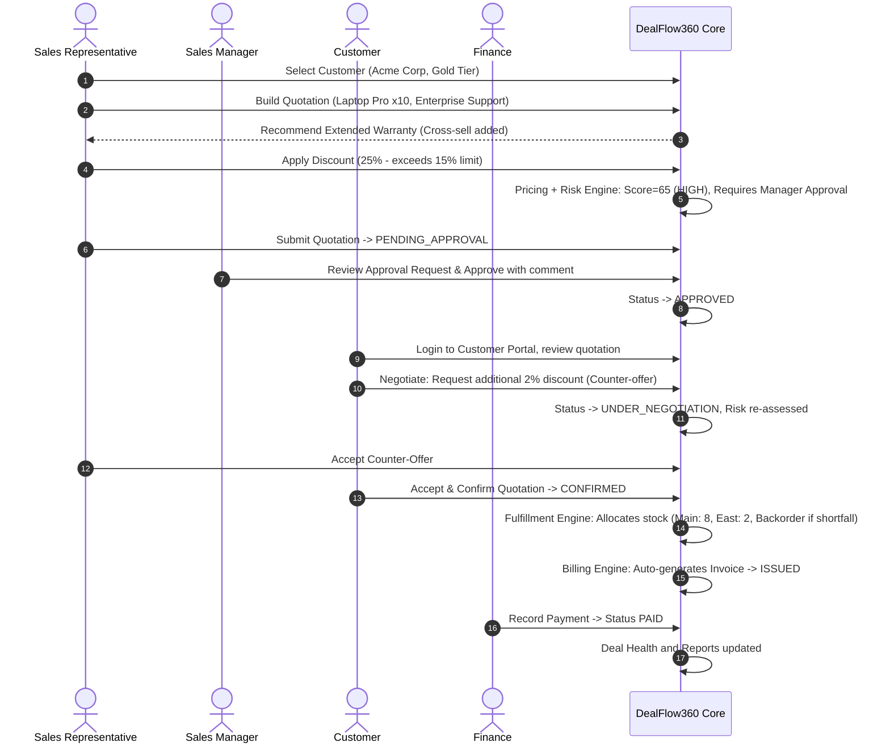

# DealFlow360 - End-to-End Workflows

## Golden Demo Workflow

```mermaid
sequenceDiagram
    autonumber
    actor Rep as Sales Representative
    actor Mgr as Sales Manager
    actor Cust as Customer
    actor Fin as Finance
    participant Sys as DealFlow360 Core

    Rep->>Sys: Select Customer (Acme Corp, Gold Tier)
    Rep->>Sys: Build Quotation (Laptop Pro x10, Enterprise Support)
    Sys-->>Rep: Recommend Extended Warranty (Cross-sell added)
    Rep->>Sys: Apply Discount (25% - exceeds 15% limit)
    Sys->>Sys: Pricing + Risk Engine: Score=65 (HIGH), Requires Manager Approval
    Rep->>Sys: Submit Quotation -> PENDING_APPROVAL
    Mgr->>Sys: Review Approval Request & Approve with comment
    Sys->>Sys: Status -> APPROVED
    Cust->>Sys: Login to Customer Portal, review quotation
    Cust->>Sys: Negotiate: Request additional 2% discount (Counter-offer)
    Sys->>Sys: Status -> UNDER_NEGOTIATION, Risk re-assessed
    Rep->>Sys: Accept Counter-Offer
    Cust->>Sys: Accept & Confirm Quotation -> CONFIRMED
    Sys->>Sys: Fulfillment Engine: Allocates stock (Main: 8, East: 2, Backorder if shortfall)
    Sys->>Sys: Billing Engine: Auto-generates Invoice -> ISSUED
    Fin->>Sys: Record Payment -> Status PAID
    Sys->>Sys: Deal Health and Reports updated
```
